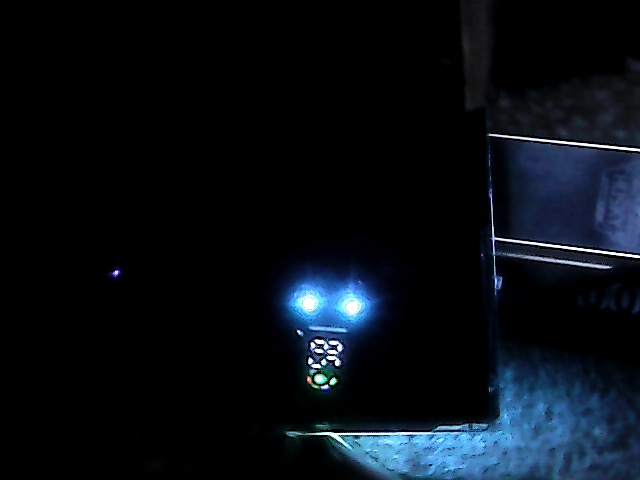

# Booklight 💡
### Подсветка для электронной книги на контроллере умного вейпа (PY32F002B / FH8020)

Проект превращения платы от одноразового умного вейпа (`W39A_V1.4`, чип **PUYA PY32F002B / FH8020**, 32-битное ядро **ARM Cortex-M0+**) в стильную, функциональную и энергоэффективную подсветку для чтения электронных книг с гибкими 3В филаментными светодиодами, сенсорной кнопкой управления и 1-Wire дисплеем **FH8016**.



---

## ✨ Основные возможности

1. **Плавная регулировка яркости (филамент 3В):**
   - Управление силовым транзистором подсветки логотипа (`PA0`).
   - Частота ШИМ: **200 Гц** на 100 шагов через SysTick (полное отсутствие мерцания).
   - Нелинейная перцептивная гамма-коррекция **CIE 1931 / Gamma 2.2** (портирована из алгоритмов AlexGyver `RGBLED / RGBMath`).

2. **Сенсорное управление (автомат `uButton`):**
   - Сенсорная кнопка (TTP223) подключается на контакт микрофона (`PB5` / `PA1` / `PA3`).
   - Программный антидребезг (25 мс).
   - **Короткий тап (< 400 мс):** плавное включение и выключение (~350 мс) с памятью последнего уровня яркости.
   - **Удержание (step):** плавный димминг в диапазоне **5%...100%**. Направление («ярче» / «темнее») автоматически меняется при каждом следующем удержании.

3. **Автоматический таймер неактивности (15 мин + 1 мин):**
   - Если лампу не трогать **15 минут**, запускается плавное, почти незаметное угасание яркости в течение **1 минуты (60 с)**.
   - **Прерываемость (Interruptible):** касание кнопки в любой момент во время минутного затухания **не выключает** лампу, а мгновенно отменяет таймер, плавно возвращает яркость чтения и перезапускает таймер на 15 минут.

4. **1-Wire дисплей FH8016:**
   - 1-проводной интерфейс управления дисплеем на частоте 2 кГц (`PA4`).
   - **Индикация заряда батареи (0–100%):** измерение напряжения 1S Li-ion аккумулятора через внутренний опорный источник **Bandgap 1.20В** без внешних делителей.
   - **Круговая шкала:** 4 деления уровня заряда.
   - **Фары (RGB-глаза):** индикация состояния аккумулятора (зелёный/циан > 30%, жёлтый 15–30%, мигающий красный < 15%).
   - **Type-C зарядка:** пин `PB4` определяет наличие 5В, зажигает иконку молнии и запускает бегущую анимацию шкалы.

5. **Глубокий сон (<10 мкА):**
   - В выключенном состоянии дисплей и ШИМ гаснут, чип переходит в режим сверхнизкого потребления **STOP** (`PWR_LOWPOWERREGULATOR_ON`).
   - Мгновенное пробуждение ядра за доли микросекунды по внешнему прерыванию **EXTI** от касания кнопки.

---

## 🔌 Схема подключения (Распиновка)

| Пин МК | Функция на плате вейпа | Назначение в Booklight | Примечание |
| :--- | :--- | :--- | :--- |
| **PA0** | Logo LED Gate | **Выход ШИМ на светодиоды филамента** | Управляет затвором MOSFET |
| **PB5** | Датчик затяжки (микрофон) | **Вход сенсорной кнопки (TTP223)** | Прерывание EXTI (Wakeup) |
| **PA4** | Charlieplexing / DAT | **1-Wire Data линия дисплея FH8016** | Протокол 2 кГц ШИМ |
| **PB4** | Монитор 5В Type-C | **Детектор подключения зарядного устройства** | Высокий уровень при 5В VBUS |
| **BAT+** | Питание схемы | **+3.7V Li-ion аккумулятор** | Напряжение измеряется через АЦП Vrefint |
| **GND** | Общий минус | **Общая земля (GND)** | |

---

## 📁 Структура репозитория

* [`custom_firmware/`](custom_firmware/) — исходный код прошивки на чистом Си (`C99`) для ARM Cortex-M0+:
  * `book_light.c` / `book_light.h` — логика подсветки, таймеров, АЦП и сна.
  * `gyver_ubutton.c` / `gyver_ubutton.h` — конечный автомат кнопки Гайвера (`uButton`).
  * `gyver_rgbmath.c` / `gyver_rgbmath.h` — перцептивная кривая `gamma2` Гайвера.
  * `fh8016_py32.c` / `fh8016_py32.h` — аппаратный драйвер 1-Wire дисплея FH8016.
  * `main.c` / `py32f002b_it.c` — инициализация периферии, SysTick 20 кГц и прерывания.
* [`d1_test/`](d1_test/) — тестовый стенд на ESP8266 (PlatformIO) для отладки протокола и визуализации экрана.
* [`py32c642_vape/`](py32c642_vape/) — библиотека HAL Driver, CMSIS PY32F0xx и принципиальная схема платы вейпа (KiCad).
* [`build.py`](build.py) — скрипт сборки прошивки с помощью `arm-none-eabi-gcc`.

---

## 🛠️ Сборка прошивки

Для компиляции требуется кросс-компилятор `arm-none-eabi-gcc`:

```powershell
python build.py
```

После компиляции генерируется бинарный файл:
`custom_firmware/build/battery_firmware.bin`

Прошивка заливается в микроконтроллер через **ST-Link V2** (SWCLK, SWDIO, GND, 3.3V, NRST) с использованием утилиты `STM32CubeProgrammer` в режиме `Connect Under Reset`.
